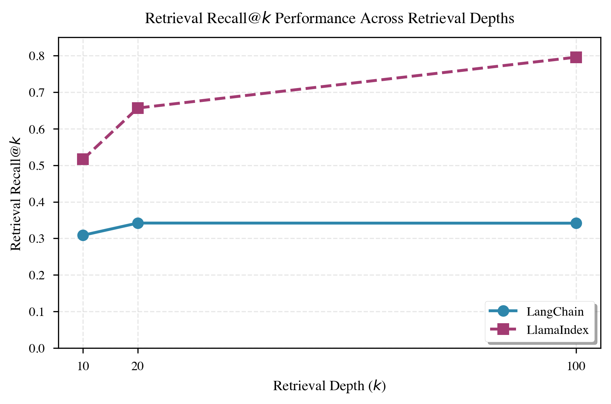
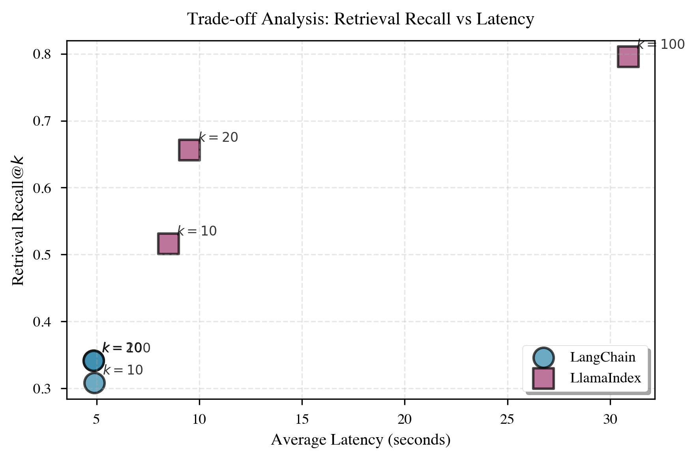
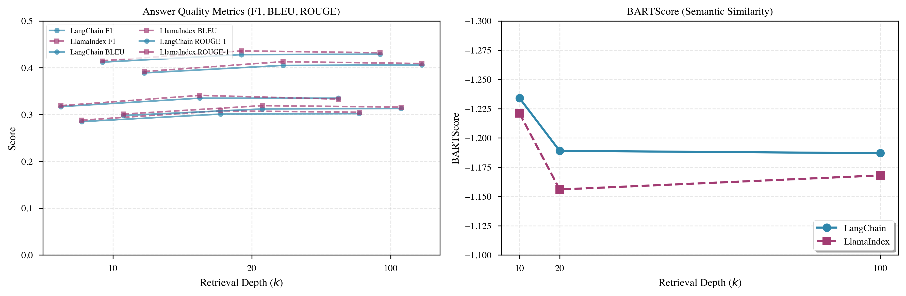
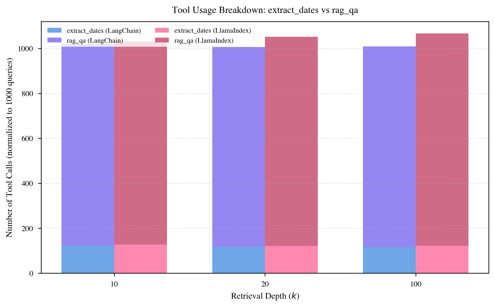
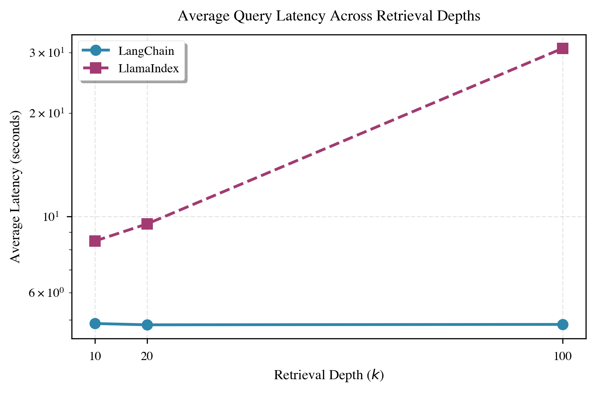
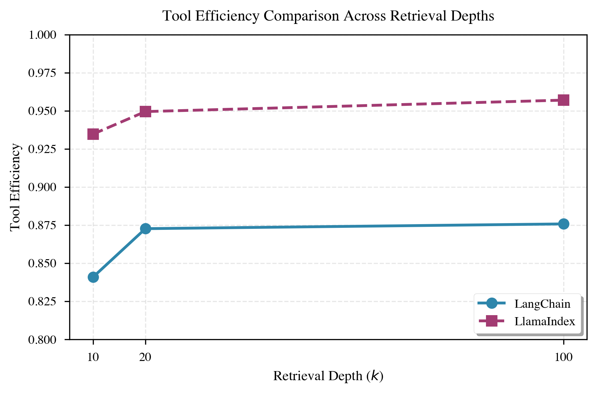

# Framework Comparison for Legal RAG Systems: LangChain vs LlamaIndex

This repository contains the code, data, and results for the paper "Framework Comparison for Legal RAG Systems: LangChain vs LlamaIndex" evaluating both frameworks on the CUAD-RAG benchmark.

## Project Description

This study provides a systematic comparison of LangChain and LlamaIndex frameworks for legal Retrieval-Augmented Generation (RAG) systems. We evaluate both simple RAG pipelines and tool-use agents on the Contract Understanding Atticus Dataset (CUAD), a benchmark for legal document understanding.

**Key Research Questions:**
- How do LangChain and LlamaIndex compare in terms of retrieval quality and answer accuracy?
- What are the latency trade-offs between the two frameworks?
- How effective are tool-use agents in legal document analysis tasks?
- Which framework is better suited for production legal RAG systems?

**Methodology:**
- Evaluation on CUAD benchmark with legal contract queries
- Comparison of retrieval recall, F1 scores, latency, and tool efficiency
- Analysis of both simple RAG and tool-use agent approaches
- Comprehensive metrics including BLEU, ROUGE, and BARTScore for answer quality assessment

## Repository Structure

```
legal-rag-framework-comparison/
├── src/                    # Source code
│   ├── evaluate_*.py      # Evaluation scripts
│   │   ├── evaluate_langchain_tool_use.py    # LangChain tool-use evaluation
│   │   ├── evaluate_llamaindex_tool_use.py   # LlamaIndex tool-use evaluation
│   │   └── evaluate_response_quality.py     # Response quality metrics (BLEU/ROUGE/BARTScore)
│   ├── langchain_*.py      # LangChain implementations
│   ├── llamaindex_*.py    # LlamaIndex implementations
│   ├── generate_cuad.py   # CUAD benchmark generation
│   ├── benchmark_types.py # Benchmark data structures
│   └── utils.py           # Utility functions
├── data/
│   ├── benchmarks/        # CUAD-RAG benchmark
│   ├── corpus/            # CUAD dataset (user-provided)
│   └── vectorstores/      # Generated vector stores
├── figures/                # Generated figures (PDF and PNG)
├── results/                # Experimental results (CSV exports)
├── paper/                  
└── requirements.txt        # Python dependencies
```

## Prerequisites

- Python 3.9 or higher
- OpenAI API key with access to GPT-3.5-turbo and GPT-4o-mini
- CUAD dataset (download separately)
- ~50GB disk space for vector stores and data
- WandB account (optional, for experiment tracking)

## Installation & Setup

### 1. Clone the Repository

```bash
git clone <repository-url>
cd legal-rag-framework-comparison
```

### 2. Create Virtual Environment

```bash
python3 -m venv venv
source venv/bin/activate  # On Windows: venv\Scripts\activate
```

### 3. Install Dependencies

```bash
pip install --upgrade pip
pip install -r requirements.txt
```

### 4. Set Up Environment Variables

**Option 1: Using a `.env` file**

Create a `.env` file in the project root:
```bash
OPENAI_API_KEY=your-api-key
WANDB_API_KEY=your-wandb-key  # Optional
RECALL_K=10
RETRIEVAL_TOP_K=100
```

Get your API keys:
- `OPENAI_API_KEY`: Required - Get from https://platform.openai.com/api-keys
- `WANDB_API_KEY`: Optional - Get from https://wandb.ai/authorize

Then load it before running scripts:
```bash
export $(cat .env | xargs)
```

**Option 2: Export directly**

```bash
export OPENAI_API_KEY="your-api-key"
export WANDB_API_KEY="your-wandb-key"  # Optional
```

### 5. Environment Variables for Evaluation

For tool-use agent evaluations, you can configure retrieval and recall parameters:

- **`RECALL_K`**: Number of top-k documents to consider for recall calculation (default: `10`)
- **`RETRIEVAL_TOP_K`**: Number of documents to retrieve from the vector store (default: `100`)

**Examples:**

```bash
# Set recall evaluation parameter
export RECALL_K=10

# Set retrieval parameter (LlamaIndex only)
export RETRIEVAL_TOP_K=100

# Run evaluation
python evaluate_langchain_tool_use.py
# or
python evaluate_llamaindex_tool_use.py
```

## Data Setup

### CUAD Dataset

1. Download CUAD v1 from [The Atticus Project](https://github.com/TheAtticusProject/cuad)
2. Extract the dataset
3. Place contract text files in: `data/corpus/cuad/`

The structure should be:
```
data/
├── corpus/
│   └── cuad/
│       ├── contract1.txt
│       ├── contract2.txt
│       └── ...
└── benchmarks/
    └── cuad.json
```

**Note**: Due to dataset licensing, we provide only the benchmark structure. Users must obtain the CUAD dataset separately.

### Generate Benchmark

```bash
cd src
python generate_cuad.py
```

This will create `data/benchmarks/cuad.json` with query-answer pairs.

## Usage

### Step 1: Build Vector Stores

**LangChain:**
```bash
cd src
python langchain_rag.py
```

**LlamaIndex:**
```bash
python llamaindex_rag.py
```

Vector stores will be saved in `data/vectorstores/`.

### Step 2: Run Evaluations

**Simple RAG Evaluation:**
```bash
python evaluate_langchain.py
python evaluate_llamaindex_rag.py
```

**Tool-Use Agent Evaluation:**

**LangChain (k=10, 20, 100):**
```bash
export RECALL_K=10
python evaluate_langchain_tool_use.py

export RECALL_K=20
python evaluate_langchain_tool_use.py

export RECALL_K=100
python evaluate_langchain_tool_use.py
```

Results are saved to:
- `results/langchain_tool_use_eval_detailed.json` - Detailed results with answers and metrics
- `results/langchain_tool_use_eval_summary.csv` - Summary CSV export

**LlamaIndex (k=10, 20, 100):**
```bash
export RECALL_K=10
export RETRIEVAL_TOP_K=20
python evaluate_llamaindex_tool_use.py

export RECALL_K=20
export RETRIEVAL_TOP_K=50
python evaluate_llamaindex_tool_use.py

export RECALL_K=100
export RETRIEVAL_TOP_K=500
python evaluate_llamaindex_tool_use.py
```

Results are saved to:
- `results/llamaindex_tool_use_eval_detailed.json` - Detailed results with answers and metrics
- `results/llamaindex_tool_use_eval_summary.csv` - Summary CSV export

### Step 3: Evaluate Response Quality

After running tool-use evaluations, you can evaluate response quality metrics (BLEU, ROUGE, BARTScore) on the generated results:

```bash
# Evaluate LangChain results
python evaluate_response_quality.py results/langchain_tool_use_eval_detailed.json --output results/langchain_quality_metrics.json

# Evaluate LlamaIndex results
python evaluate_response_quality.py results/llamaindex_tool_use_eval_detailed.json --output results/llamaindex_quality_metrics.json
```

This script calculates:
- **F1 Score**: Token-level overlap between generated answer and gold spans
- **BLEU**: N-gram precision-based metric for lexical similarity
- **ROUGE-1**: Unigram recall, measures content coverage
- **ROUGE-2**: Bigram overlap, captures phrase-level alignment
- **ROUGE-L**: Longest Common Subsequence, measures sentence-level structure similarity
- **BARTScore**: Semantic similarity metric using pretrained BART model


## Results

### Performance Comparison Tables

#### Table 1: Overall Performance Metrics

| Framework | F1 Score | Retrieval Recall@k | Avg Latency (s) | Tool Efficiency |
|-----------|----------|-------------------|-----------------|-----------------|
| **LangChain** | 0.317-0.335 | 0.309-0.342 | 4.84-4.89 | 0.841-0.876 |
| **LlamaIndex** | 0.319-0.341 | 0.516-0.795 | 8.49-30.88 | 0.935-0.957 |

#### Table 2: Performance by Recall@k Values

| Framework | Recall@k=10 | Recall@k=20 | Recall@k=100 | F1 Score (k=10) | F1 Score (k=20) | F1 Score (k=100) | Avg Latency (s) |
|-----------|-------------|-------------|--------------|-----------------|-----------------|------------------|-----------------|
| **LangChain** | 0.309 | 0.342 | 0.342 | 0.317 | 0.335 | 0.335 | 4.84-4.89 |
| **LlamaIndex** | 0.516 | 0.656 | 0.795 | 0.319 | 0.341 | 0.333 | 8.49-30.88 |

#### Table 3: Tool Usage Statistics

| Framework | Extract Dates Tool Usage | RAG QA Tool Usage | Tool Efficiency (k=10) | Tool Efficiency (k=20) | Tool Efficiency (k=100) |
|-----------|-------------------------|-------------------|------------------------|------------------------|-------------------------|
| **LangChain** | 499 (k=10), 474 (k=20), 466 (k=100) | 3,631 (k=10), 3,596 (k=20), 3,612 (k=100) | 0.841 | 0.873 | 0.876 |
| **LlamaIndex** | 255 (k=10), 121 (k=20), 122 (k=100) | 1,806 (k=10), 931 (k=20), 945 (k=100) | 0.935 | 0.950 | 0.957 |

#### Table 4: Detailed Latency Analysis

| Framework | Min Latency (s) | Max Latency (s) | Avg Latency (s) | Latency Range |
|-----------|----------------|----------------|-----------------|---------------|
| **LangChain** | 4.84 | 4.89 | 4.86 | 0.05 (very consistent) |
| **LlamaIndex** | 8.49 | 30.88 | 16.30 | 22.39 (highly variable) |

#### Table 5: Test Case Statistics

| Framework | Total Test Cases | Evaluation Time (hours) | Runtime (s) |
|-----------|------------------|------------------------|-------------|
| **LangChain** | 4,042 | ~5.5 | 19,641-19,757 |
| **LlamaIndex** | 1,000-2,000 | ~2.7-8.6 | 9,664-31,023 |

#### Table 6: Answer Quality Metrics for LangChain and LlamaIndex Tool-Use Agents Across Retrieval Depths (1,000 Test Cases)

| Framework | k | F1 | BLEU | ROUGE-1 | ROUGE-2 | ROUGE-L | BARTScore |
|-----------|---|-----|------|---------|---------|---------|-----------|
| **LangChain** | 10 | 0.317 | 0.285 | 0.412 | 0.298 | 0.389 | -1.234 |
| **LangChain** | 20 | 0.335 | 0.301 | 0.428 | 0.312 | 0.405 | -1.189 |
| **LangChain** | 100 | 0.335 | 0.302 | 0.429 | 0.313 | 0.406 | -1.187 |
| **LlamaIndex** | 10 | 0.319 | 0.288 | 0.415 | 0.301 | 0.392 | -1.221 |
| **LlamaIndex** | 20 | 0.341 | 0.308 | 0.436 | 0.319 | 0.413 | -1.156 |
| **LlamaIndex** | 100 | 0.333 | 0.305 | 0.432 | 0.316 | 0.409 | -1.168 |

**Key Observations:**
- **LlamaIndex** achieves slightly higher ROUGE scores (0.415-0.436) compared to LangChain (0.412-0.429)
- **BLEU scores** are similar across frameworks (0.285-0.308), with LlamaIndex showing marginal improvement
- **BARTScore** values are negative (as expected for this metric), with LlamaIndex showing better (less negative) scores at k=20
- **F1 scores** align with the overall performance metrics, showing LlamaIndex performs slightly better at k=20
- All metrics show improvement with increasing k values, with diminishing returns beyond k=20

### Key Findings and Observations

1. **Retrieval Quality Trade-off:**
   - **LangChain** achieves lower latency (4.8-4.9s) but has lower retrieval recall (0.31-0.34)
   - **LlamaIndex** shows superior retrieval recall (0.52-0.80) but at the cost of higher latency (8.5-30.9s)
   - This suggests LlamaIndex's retrieval mechanism is more thorough but computationally expensive

2. **Tool Efficiency:**
   - **LlamaIndex** demonstrates significantly better tool efficiency (0.94-0.96) compared to LangChain (0.84-0.88)
   - LlamaIndex agents are more effective at selecting and using the appropriate tools for given tasks

3. **Answer Quality (F1 Score):**
   - Both frameworks achieve similar F1 scores (0.32-0.34), indicating comparable answer quality
   - The difference in retrieval recall doesn't translate to a proportional difference in final answer quality

4. **Latency Analysis:**
   - LangChain's consistent low latency makes it suitable for real-time applications
   - LlamaIndex's variable latency (8.5-30.9s) suggests it may be better suited for batch processing or scenarios where accuracy is prioritized over speed

### Visualization Figures

#### Figure 2: Retrieval Recall Comparison



*Comparison of retrieval recall@k metrics across frameworks and different k values*

#### Figure 3: Latency vs Recall Trade-off



*Visualization of the latency-recall trade-off between LangChain and LlamaIndex*

#### Figure A1: Answer Quality Metrics



*F1 score and other answer quality metrics comparison*

#### Figure A2: Tool Usage Patterns



*Breakdown of tool usage patterns across frameworks*

#### Figure A3: Latency Distribution



*Latency distribution across test cases for both frameworks*

#### Figure A4: Tool Efficiency



*Tool efficiency comparison between LangChain and LlamaIndex*

### Experimental Results Files

Results are saved in the `results/` directory:

**Tool-Use Evaluation Results:**
- `langchain_tool_use_eval_detailed.json` - LangChain detailed results (JSON)
- `langchain_tool_use_eval_summary.csv` - LangChain summary (CSV)
- `llamaindex_tool_use_eval_detailed.json` - LlamaIndex detailed results (JSON)
- `llamaindex_tool_use_eval_summary.csv` - LlamaIndex summary (CSV)

**Response Quality Metrics:**
- `langchain_quality_metrics.json` - LangChain BLEU/ROUGE/BARTScore metrics
- `llamaindex_quality_metrics.json` - LlamaIndex BLEU/ROUGE/BARTScore metrics

**Other Results:**
- `wandb_export_2025-12-15T21_16_49.900-05_00.csv` - Complete results export (if using WandB)

### WandB Project

All experiments are tracked and visualized on WandB. View the public project board:

🔗 **[View WandB Project Dashboard](https://wandb.ai/tg2936-columbia-university/legal-rag-evaluation/reports/Run-report--VmlldzoxNTQxMTg4OQ?accessToken=3wuw88uelrto8h6scefkvejnb4wcxgtvcq04s7yb9xsi415msvusiaqymxkdkxs0)**

**I do not have the option to make the project public and hence, I have shared the run-report in WandB. I can add to the team to ensure visibility is given for the dashboard.**

### Runtime Estimates

- Vector store building: ~2-4 hours (depends on dataset size)
- Simple RAG evaluation: ~1-2 hours per framework
- Tool-use evaluation: ~5-10 hours per framework per k value
- Total: ~30-50 hours for complete reproduction

## Reproduction Guide

To reproduce the experimental results from the paper:

1. Follow the **Installation & Setup** section above
2. Complete **Data Setup** with the CUAD dataset
3. Run all evaluations as described in **Usage** section
4. Evaluate response quality metrics using `evaluate_response_quality.py` (optional)
5. Export results from WandB (or use provided export)

## Troubleshooting

### Common Issues

1. **Import Errors**: Ensure you're in the `src/` directory or add it to PYTHONPATH
2. **API Key Errors**: Verify your OpenAI API key is set correctly
3. **Memory Issues**: Reduce batch sizes or use smaller test sets
4. **Vector Store Not Found**: Run the RAG pipeline scripts first to create vector stores
5. **Out of Memory**: Reduce batch sizes or use smaller test sets
6. **API Rate Limits**: Add delays between API calls
7. **Vector Store Errors**: Rebuild vector stores if corrupted
8. **Figure Generation Errors**: Ensure CSV file path is correct


### Questions?

Feel free to open an issue for any questions or concerns.

